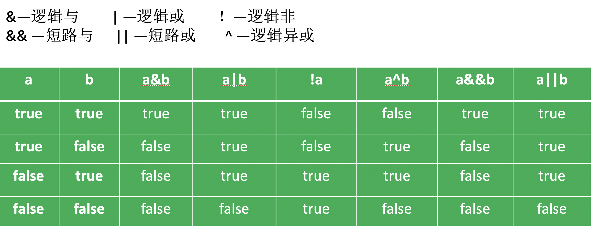

# 目录
[toc]
## Java课程笔记
### 基础概念
**软件开发**：数据与指令的集合。分为系统软件和应用软件。
**人机交互方式**：图形化界面（GUI），命令行界面。
**计算机语言**：人与计算机交流的语言。
**面向过程与面向对象**：
面向过程
优点：性能比面向对象高，因为类调用时需要实例化，开销比较大，比较消耗资源;比如单片机、嵌入式开发、 Linux/Unix等一般采用面向过程开发，性能是最重要的因素。
缺点：没有面向对象易维护、易复用、易扩展
面向对象
优点：易维护、易复用、易扩展，由于面向对象有封装、继承、多态性的特性，可以设计出低耦合的系统，使系统 更加灵活、更加易于维护
缺点：性能比面向过程低
**Java两大机制**
1.Java虚拟机（Java Virtal Machine）,JVM :
JVM是一个虚拟的计算机，具有指令集并使用不同的存储区域。负责执行命令，管理数据、内存和寄存器。对于不同的平台，有不用的虚拟机。Java虚拟机机制屏蔽了底层运行平台的差异，实现了“一次编译，到处运行”。
2.垃圾回收机制（Garbage Collection),GC:
c，c++，有程序员手动回收，优点是：能在内存不使用时快速回收，准确高效；缺点：容易出现bug，如容易忘记回收。
Java自动回收，开启系统级线程自动检测回收。优点，不容易忘记；缺点：回收不及时。
**Java名称命名规范**
包名：多单词组成时所有字母都小写：xxxyyyzzz
类名、接口名：多单词组成时，所有单词首字母大写：XxxYyyZzz
变量名、方法名：多单词组成时，第一个单词首字母小写，第二个单词开始每个单词首字母大写：xxxYyyZzz
常量名：所有字母都大写，多单词时每个单词用下划线连接：XXX_YYY_ZZZ
### 变量
**变量的概念：**
定义变量的格式：数据类型 变量名 = 初始化值
Java中的变量必须先声明后使用，定义时必须初始化值
变量的作用域在一对{}之间有效

**变量的分类**


**基本数据类型转换：**

1.自动类型转换：容量小的类型自动转换为容量大的类型。数据类型按容量大小排序为：
有多种类型的数据混合运算时，系统首先自动将所有数据转换成容量大的那种数据类型，然后在进行运算。
2.byte、short、char之间不会进行相互转换，它们三者在计算时首先转换成int类型。
3。当把任何基本类型的的值和字符串值进行连接运算时（+），基本类型的值将自动转化成为字符串类型。
4.当有一系列+运算时，如果某个部分含有字符串，那么从这个字符串前边挨着的+开始要以字符串的拼接去看。

**强制类型转换：**
1.强制将容量大的数据类型转换成容量小的数据类型时，需要使用强制转换运算符。但可能造成精度降低或者溢出。
```Java
int k = 7;
byte i = (byte)k;
```
2.通常字符串不能直接转换成为基本类型，但通过基本类型对应的包装规则可以实现把字符串转换成基本类型。
```Java
String a = "43";
int i = Integer.parseInt(a);
```
3.boolean类型不可以转换成其他的数据类型。

### 运算符
运算符是一种特殊的符号，用以表示数据的运算、赋值和比较等。
1.算术运算符
2.赋值运算符
3.比较运算符（关系运算符）
4.逻辑运算符
5.位运算符
6.三元运算符


#### 算数运算符

**key**
1.如果对负数取模，可以把模数负号忽略不记，如：5%-2=1。 但被模数是负数则不可忽略。此外，取模运算的结果不一定总是整数。

2.对于除号“/”，它的整数除和小数除是有区别的：整数之间做除法时，只保留整数部分而舍弃小数部分。 
      例如：int x=3510;x=x/1000*1000;  x的结果是3000

3.“+”除字符串相加功能外，还能把非字符串转换成字符串.例如：System.out.println("5+5="+5+5); //打印结果是？5+5=55

以下二者的区别：
```Java
System.out.println('*' + '\t' +'*'); //char类型数据可以转为ASCII码进行计算，因此结果为93
System.out.println("*" + '\t' +'*');//字符串与其他类型数据相加时，实际上是把其他数据转换为字符串，做字符串拼接
```
#### 赋值运算符
符号：= 
1.当“=”两侧数据类型不一致时，可以使用自动类型转换或使用强制类型转换原则进行处理。
2.支持连续赋值。
3.扩展赋值运算符： +=, -=, *=, /=, %=
**key**
拓展运算符的作用：变量在参与运算时会把结果自动转换为当前变量的类型

```Java
short s = 3

1. s = （short）（s + 2）；

2. s += 2；

```
公式1等同于公式2。为什么公式1要加强制类型转换：
因为变量参与运算时，Java不知道计算结果会不会超出范围，所以会把结果自动转换为大容量的类型。因此要做强制类型转换，否则会报错

**思考题：**
```Java
int i = 1;
i *=0.1;
System.out.println(i); //i = 0
i++;
System.out.println(i);//i = 1
```

#### 逻辑运算符
**基本知识：**


**key**：

1.逻辑运算符用于连接布尔型表达式，在Java中不可以写成3<x<6，应该写成x>3 & x<6 。

2.“&”和“&&”的区别：
**单&时，左边无论真假，右边都进行运算；
双&时，如果左边为真，右边参与运算，如果左边为假，那么右边不参与运算**。
“|”和“||”的区别同理，||表示：当左边为真，右边不参与运算。
在不需要逻辑运算两边都参与运算的时候，尽量使用&&和||
e.g:
```Java
int i = 0;
int k = 1;
System.out.println(i != 0 & ++k = 2);//此时输出k = 1
System.out.println(i != 0 && ++k = 2);//此时输出 k =2
System.out.println(k);
```
练习题：
```Java
int x = 1;
int y=1;

if(x++==2 & ++y==2){
	x =7;
}
System.out.println("x="+x+",y="+y);//2 2
```

```Java
int x = 1,y = 1;

if(x++==2 && ++y==2){
	x =7;
}
System.out.println("x="+x+",y="+y);//2 1
```


#### 位运算符


#### 三元/目运算符
格式：
（条件表达式）？表达式1 : 表达式2;

练习题：获取三个数之中的最大数：
m>n?(m>k? m :k):(n>k? n : k);

#### 运算符优先级

帮记口诀：**单目乘除为关系，逻辑三目后赋值**

单目：单目运算符+ –(负数) ++ -- 等

乘除：算数运算符* / % + -

为：位移单目运算符<< >>

关系：关系运算符> < >= <= == !=

逻辑：逻辑运算符&& || & | ^

三目：三目运算符A > B ? X : Y

后：无意义，仅仅为了凑字数

赋值：赋值=

### 数组
一维数组的声明方式：type  var[] 或 type[]  var
```Java
int[] a;
int a[];
```
二维数组的声明方式：
```Java
int[][] y 或者  int[] y[]  或者 int  y[][]
```

数组初始化：
1.数组动态初始化：数组声明且为数组元素分配空间（new）与赋值的操作分开进行。
```Java
int[] arr = new int[3];
arr[0] = 3;
arr[1] = 9;
arr[2] = 8;
```
数组动态初始化时，数组的元素会有默认值，数字类型的默认值为0，对象的默认类型为null。
2.数组静态初始化：在定义数组的同时就为数组元素分配空间并赋值。
```Java
int a[] = new int[]{ 3, 9, 8};
int[] a = {3,9,8};
```
For-Each 循环
JDK 1.5 引进了一种新的循环类型，被称为 For-Each 循环或者加强型循环，它能在不使用下标的情况下遍历数组。
语法格式如下：
```Java
for(type element: array)
{
    System.out.println(element);
}

//示例
public class TestArray {-1
   public static void main(String[] args) {
      double[] myList = {1.9, 2.9, 3.4, 3.5};
 
      // 打印所有数组元素
      for (double element: myList) {
         System.out.println(element);
      }
   }
}
```

数组练习题：


### 类和对象

现实世界万事万物是由分子、原子构成的。同理，Java代码世界是由诸多个不同功能的类构成的
1.面向对象的三大特色：
封装
继承
多态

2.public和private：
修饰符private:该属性只能由该类的方法访问，不能通过对象.属性的方式调用
修饰符public:该属性可以被该类以外的方法访问
```Java
public Class Person{
	public String name = "123";
	private int age;//成员变量有默认初始化值
	public void showAge{
		System.out.println(age);
	}
}
Person p = new Person()
p.name//可以使用
p.age//不可使用。因为age为私有变量
```
3.变量的分类（补充）

类变量：不需要实例成对象，直接通过类名.属性就可调用的变量
实例变量：类实例化之后才能使用的变量
```Java
public Class Person{
	public static String sex = "male";

	private int age = 1;
	public void showAge{
		System.out.println(age);
	}
}
Person.sex // 类变量直接调用
```
代码块局部变量：
```Java
public Class Person{
	{
		int i =0; // 代码块局部变量
	}
}
Person.sex // 类变量直接调用
```
4.类的访问机制：
在一个类中的访问机制：类中的方法可以直接访问类中的成员变量。（例外：static方法访问非static的成员变量，编译不通过。）
在不同类中的访问机制：先创建要访问类的对象，再用对象访问类中定义的成员。

5.重载
重载的概念：
在同一个类中，允许存在一个以上的同名方法，只要它们的参数个数或者参数类型不同即可。
重载的特点：
与返回值类型无关，只看参数列表，且参数列表必须不同。(参数个数或参数类型)。调用时，根据方法参数列表的不同来区别。

6.可变个数参数
```Java
public class Person3 {
	/**
	 * 用数组的方式来传递可变个数的参数
	 * 如果没有参数，就要定义一个空数组或者是null
	 * @param args
	 */
	public void printInfo(String[] args){//问题，我们能够的打印的信息都有来源于方法的参数也就是形参的传递
		//我现在可能给方法要传递的不同的参数？如果在这种情况下，我们不知道想要给方法传递多少个参数（姓名、性别、年龄；也可能身份证号码、家庭住址、手机号）
		for(int i = 0; i < args.length; i++){
			System.out.println(args[i]);
		}
	}
	/**
	 * 用java特有的...的方式来传递可变个数的参数，这种参数在使用时与数组的使用方式相同
	 * 如果没有参数就可以不填.
	 * 这种...代表可以传递0到多个参数
	 * 如果一个方法有多个的形参，可变的形参（...这种的参数）一定要放在所有的参数最后
	 * printInfo1(String s,int d,String... args)这样的放置参数的方式是对的
	 * printInfo1(String s,String... args,int d)这样的放置参数的方式是不对的
	 * printInfo1(String... args,String s,int d)这样的放置参数的方式是不对的
	 * @param args
	 */
	public void printInfo1(String... args){
		for(int i = 0; i < args.length; i++){
			System.out.println(args[i]);//可变参数的使用与数组相同
		}
	}
	
	public void test(int... i){
		
	}
}

public class Test5 {
	public static void main(String[] args) {
		Person3 p3 = new Person3();
//		String[] ss = new String[]{"zhangsan","11"};
//		p3.printInfo(ss);
//		String[] ss1 = new String[]{"北京市xxx","13133334444","152109874523666541"};
//		p3.printInfo(ss1);
		
//		p3.printInfo1("lisi","23","男","","");
//		
		String[] ss2 = new String[]{"北京市xxx","13133334444","152109874523666541"};
		p3.printInfo1(ss2);
		p3.printInfo1();//如果没有参数就可以不填
		p3.printInfo(null);
	}
}
```

7. 参数传递
参数传递的过程实际就是值的传递，而基本数据类型与引用类型的在值传递过程中的不同点在于：基本数据类型存储在栈中的是值本身，而引用类型存储在栈内存中的是对象的地址。


**面试必备排序算法：**
https://juejin.im/post/5b95da8a5188255c775d8124

### 包
*  包帮助管理大型软件系统：将语义近似的类组织到包中；解决类命名冲突的问题。
* 包可以包含类和子包
#### package
* package语句作为Java源文件的第一条语句，指明该文件中定义的类所在的包。(若缺省该语句，则指定为无名包)。它的格式为：
	package 顶层包名.子包名 ;
	举例：
	```Java
	pack\Test.java
		package p1;    //指定类Test属于包p1
		public class Test{
		        public void display(){
			System.out.println("in  method display()");
		        }
		}
	```
* 包对应于文件系统的目录，package语句中，用 “.” 来指明包(目录)的层次；
* 包通常用小写单词，类名首字母通常大写。

#### import
* 为使用定义在不同包中的Java类，需用import语句来引入指定包层次下所需要的类或全部类(.\*)。import语句告诉编译器到哪里去寻找类。
语法格式：
	import  包名[.子包名…]. <类名 |*>
应用举例： 
```Java
	import  p1.Test;   //import p1.*;表示引入p1包中的所有类
	public class TestPackage{
		public static void main(String args[]){
		          Test t = new Test();          //Test类在p1包中定义
		          t.display();
		}
      }
```
* 若引入的包为：java.lang，则编译器默认可获取此包下的类，不需要再显示声明。
* import语句出现在package语句之后、类定义之前
* 一个源文件中可包含多个import语句
* 可以使用import lee.* ;语句，表明导入lee包下的所有类。而lee包下sub子包内的类则不会被导入。import lee.sub.*;
* import语句不是必需的，可坚持在类里使用其它类的全名
* JDK 1.5加入import static语句

### 封装和隐藏
* 使用者对类内部定义的属性(对象的成员变量)的直接操作会导致数据的错误、混乱或安全性问题
* Java中通过将数据声明为私有的(private)，再提供公共的（public）方法:getXxx()和setXxx()实现对该属性的操作，以实现下述目的：
1.隐藏一个类中不需要对外提供的实现细节；
2.使用者只能通过事先定制好的方法来访问数据，可以方便地加入控制逻辑，限制对属性的不合理操作；
3.便于修改，增强代码的可维护性
```Java
public class Person {
	public int age;//像这种情况，是把类的属性开发出来，让调用者随意使用，这样会有问题
}
public class Test {
	public static void main(String[] args) {
		Person p = new Person();
		p.age = -100;//这样的情况，程序是对的，能执行，但是不符合正常逻辑
	}
}
```
因此，我们对属性和进行封装和隐藏。
```Java
public class Person {
//	public int age;//像这种情况，是把类的属性开发出来，让调用者随意使用，这样会有问题
	
	//我们需要对这样不能让调用者随意使用的属性做封装和隐藏
	private int age;
	
	public void printAge(){
		System.out.println("年龄是：" + age);
	}
	
	public int getAge(){
		return age;
	}
	
	public void setAge(int a){
		if(a <= 130 && a >= 0){
			age = a;
		}else{
			System.out.println("输入的年龄：" + a + " 不在0到150之间");
		}
	}
}

public class Test {
	public static void main(String[] args) {
		Person p = new Person();
////		p.age = -100;//这样的情况，程序是对的，能执行，但是不符合正常逻辑
//		//像这种情况，是把类的属性开发出来，让调用者随意使用，这样会有问题
		p.setAge(12);
		p.printAge();
	}
}
```
### Super
在Java类中使用super来调用父类中的指定操作（多层继承）：
* super可用于访问父类中定义的属性
* super可用于调用父类中定义的成员方法
* super可用于在子类构造方法中调用父类的构造器
注意：
* 尤其当子父类出现同名成员时，可以用super进行区分
* super的追溯不仅限于直接父类
* super和this的用法相像，this代表本类对象的引用，super代表父类的内存空间的标识

### 访问权限修饰符


### 抽象类
* 用abstract关键字来修饰一个类时，这个类叫做抽象类；
* 用abstract来修饰一个方法时，该方法叫做抽象方法。
* 抽象方法：只有方法的声明，没有方法的实现。以分号结束：abstract int abstractMethod( int a );
* 含有抽象方法的类必须被声明为抽象类。
* 抽象类不能被实例化。抽象类是用来作为父类被继承的，抽象类的子类必须重写父类的抽象方法，并提供方法体。若没有重写全部的抽象方法，仍为抽象类。
* 不能用abstract修饰属性、私有方法、构造器、静态方法、final的方法
* 抽象类不一定非要有抽象方法。
* 一个抽象类中可以定义构造器吗？
抽象类可以有构造方法，只是不能直接创建抽象类的实例对象而已。

### 接口
* 有时必须从几个类中派生出一个子类，继承它们所有的属性和方法。但是，Java不支持多重继承。有了接口，就可以得到多重继承的效果。
* 接口(interface)是抽象方法和常量值的定义的集合。
* 从本质上讲，接口是一种特殊的抽象类，这种抽象类中只包含常量和方法的定义，而没有变量和方法的实现。
* 实现接口类：
class SubClass implements InterfaceA{ }
* 一个类可以实现多个接口，接口也可以继承其它接口

ISO的七层模型 ： 物理层、数据链路层、网络层、传输层、表示层、会话层、应用层
 Socket属于传输层，它是对Tcp/ip协议的实现，包含TCP/UDP,它是所有通信协议的基础，Http协议需要Socket支持，以Socket作为基础
netstat -nlp |grep LISTEN   //查看当前所有监听端口·
netstat -nlp |grep 80   //查看所有80端口使用情况·
##笔试
## 面试
实习经历：
思科：主要完成了一个自动生成测试脚本的工具，采用的框架是Django
前端：bootstrap
数据交互：Ajax
后台：python
* 基本流程：
读取用户输入，以JSON格式用Ajax传送至后台，后台接受数据后根据变量值调用相关函数接口，返回输出值，存储至数据库，并根据输出值刷新页面内容。
* 主要功能：
  测试设备的多模式编辑1.图形化操作 测试设备的增加，删除，编辑 2.JSON脚本编辑模式 
* 使用的一些插件
  joint.js 图形的拖拽编辑backbone.js 单页面富应用require.js 模块化管理、异步加载
* 遇到的问题解决方案
  原有开发的分辨率适配问题，针对该问题采用流式布局+弹性布局的解决方案
* 数据库表结构  用户表 设备表 项目表 设备配置信息表
  
尊敬的面试官，您好：
我是丁鑫，东华大学研二。自入校以来，我一直都是学校的活跃分子，在学习和社会工作都充满了热情。不仅多次获得东华大学优秀学生及优秀学生干部的称号，我积极参与数据建模等比赛。在研究生期间，我还参与了实验室的聚酯、聚酰胺纤维柔性化高效制备技术项目，此项目是对聚酯、聚酰胺工业聚合过程建模与模拟，承担了对聚酰胺融合与熔体输送部分进行数学建模与数据挖掘工作，针对聚酰胺合成过程中的压力、温度、特性黏度等时序数据，做了无监督的时序数据聚类建模，此部分已经纂写论文，在投。
根据整个项目的需要，将算法作为调用接口，供java层调用。此过程采用python与java建立WebService的模式，通过JSON格式进行数据的传输，最后做成API供项目调用。
此过程使用git对代码进行版本控制，并在实验室的Jenkins服务器下，自动部署。
**软件环境：**
Ubuntu18.04；win10;  mysql5.7； java； python
**硬件环境：**
Dell T640 ; 
**开发工具:**
vscode Xshell git
**项目与责任描述：**
**项目名称:**
聚酯、聚酰胺纤维柔性化高效制备技术；
**项目简介：**
此项目是对聚酯、聚酰胺工业聚合过程建模与模拟，针对聚酯三釜流程，搭建了具有普适性的酯化、预聚、缩聚过程工程模型；针对聚酰胺6VK管聚合过程，搭建了前加压，后减压两段式聚合过程工程模型。在上述建模基础上，分别对于聚酯、聚酰胺聚合过程进行了聚合工艺模拟研究。并从材料参量仿真、流场仿真、成型过程仿真、结构与性能关系等方面构建了聚酰胺纤维纺丝动力学模型，结合纤维冷却过程中传热和纤维受力机理，建立对冷却过程中气流场与纤维成形耦合作用的动力学数学模型。
**项目承担的工作：**
1. 承担了对聚酰胺融合与熔体输送部分进行数学建模与数据挖掘工作，针对聚酰胺合成过程中的压力、温度、特性黏度等时序数据，做了无监督的时序数据聚类建模，为项目的全流程提供数据挖掘支撑。在建模过程中，会依靠MySql数据库多表联查，按照时间点对齐数据抽取出来；对抽取的数据建立无监督CNN特征抽取模型算法，提取时序数据的统计特征，再次根据数据的特征，进行基于CNN辅助的DBSCN的时序数据聚类。聚类后数据，将作为项目中检测的支撑，此部分已经纂写论文，在投。
2. 根据整个项目的需要，将算法作为调用接口，供java层调用。此过程采用python与java建立WebService的模式，通过JSON格式进行数据的传输，最后做成API供项目调用。
3. 此过程使用git对代码进行版本控制，并在实验室的Jenkins服务器下，自动部署。
### 东方财富
1 上去写个快排，生产者消费者模式；
2 ConcurrentHashMap实现
3 怎么保证线程t1,t2,t3按顺序执行
4 Spring IOC、AOP解释一下
5 怎么实现自定义注解（这个不知道）
6 数据库怎么实现行列转换，当时没听过这个概念，百度一下一大堆
7 MySQL读写分离，怎么实现，同步
8 redis主从复制
9 JSP内置对象
10 NIO、AIO区别
11 wait和sleep区

### Java面试208
1. JDK 和 JRE 有什么区别？

JDK：Java Development Kit 的简称，java 开发工具包，提供了 java 的开发环境和运行环境。
JRE：Java Runtime Environment 的简称，java 运行环境，为 java 的运行提供了所需环境。
具体来说 JDK 其实包含了 JRE，同时还包含了编译 java 源码的编译器 javac，还包含了很多 java 程序调试和分析的工具。

2. == 和 equals 的区别是什么？
 == 解读

对于基本类型和引用类型 == 的作用效果是不同的，如下所示：

基本类型：比较的是值是否相同；

引用类型：比较的是引用是否相同；

而 equals 默认情况下是引用比较，只是很多类重新了 equals 方法，比如 String、Integer 等把它变成了值比较，所以一般情况下 equals 比较的是值是否相等。

4. final 在 java 中有什么作用？

final 修饰的类叫最终类，该类不能被继承。
final 修饰的方法不能被重写。
final 修饰的变量叫常量，常量必须初始化，初始化之后值就不能被修改

5. java 中的 Math.round(-1.5) 等于多少？
等于 -1，因为在数轴上取值时，中间值（0.5）向右取整，所以正 0.5 是往上取整，负 0.5 是直接舍弃。

6. String 属于基础的数据类型吗？
String 不属于基础类型，基础类型有 8 种：byte、boolean、char、short、int、float、long、double，而 String 属于对象

7. java 中操作字符串都有哪些类？它们之间有什么区别？
操作字符串的类有：String、StringBuffer、StringBuilder。
String 和 StringBuffer、StringBuilder 的区别在于 String 声明的是不可变的对象，每次操作都会生成新的 String 对象，然后将指针指向新的 String 对象，而 StringBuffer、StringBuilder 可以在原有对象的基础上进行操作，所以在经常改变字符串内容的情况下最好不要使用 String。
StringBuffer 和 StringBuilder 最大的区别在于，StringBuffer 是线程安全的，而 StringBuilder 是非线程安全的，但 StringBuilder 的性能却高于 StringBuffer，所以在单线程环境下推荐使用 StringBuilder，多线程环境下推荐使用 StringBuffer

8. String str="i"与 String str=new String("i")一样吗？
不一样，因为内存的分配方式不一样。String str="i"的方式，java 虚拟机会将其分配到常量池中；而 String str=new String("i") 则会被分到堆内存中。

9. 如何将字符串反转？
使用 StringBuilder 或者 stringBuffer 的 reverse() 方法。

10. String 类的常用方法都有那些？
indexOf()：返回指定字符的索引。

charAt()：返回指定索引处的字符。

replace()：字符串替换。

trim()：去除字符串两端空白。

split()：分割字符串，返回一个分割后的字符串数组。

getBytes()：返回字符串的 byte 类型数组。

length()：返回字符串长度。

toLowerCase()：将字符串转成小写字母。

toUpperCase()：将字符串转成大写字符。

substring()：截取字符串。

equals()：字符串比较。

11. 抽象类必须要有抽象方法吗？
不需要，抽象类不一定非要有抽象方法。

12. 普通类和抽象类有哪些区别？
普通类不能包含抽象方法，抽象类可以包含抽象方法。
抽象类不能直接实例化，普通类可以直接实例化。

13. 抽象类能使用 final 修饰吗？
不能，定义抽象类就是让其他类继承的，如果定义为 final 该类就不能被继承，这样彼此就会产生矛盾，所以 final 不能修饰抽象类，

14. **接口和抽象类有什么区别？**
实现：抽象类的子类使用 extends 来继承；接口必须使用 implements 来实现接口。

构造函数：抽象类可以有构造函数；接口不能有。

main 方法：抽象类可以有 main 方法，并且我们能运行它；接口不能有 main 方法。

实现数量：类可以实现很多个接口；但是只能继承一个抽象类。

访问修饰符：接口中的方法默认使用 public 修饰；抽象类中的方法可以是任意访问修饰符。

15. java 中 IO 流分为几种？
按功能来分：输入流（input）、输出流（output）。
按类型来分：字节流和字符流。
字节流和字符流的区别是：字节流按 8 位传输以字节为单位输入输出数据，字符流按 16 位传输以字符为单位输入输出数据。

16. BIO、NIO、AIO 有什么区别？
BIO：Block IO 同步阻塞式 IO，就是我们平常使用的传统 IO，它的特点是模式简单使用方便，并发处理能力低。
NIO：New IO 同步非阻塞 IO，是传统 IO 的升级，客户端和服务器端通过 Channel（通道）通讯，实现了多路复用。
AIO：Asynchronous IO 是 NIO 的升级，也叫 NIO2，实现了异步非堵塞 IO ，异步 IO 的操作基于事件和回调机制。

17. Files的常用方法都有哪些？
Files.exists()：检测文件路径是否存在。
Files.createFile()：创建文件。
Files.createDirectory()：创建文件夹。
Files.delete()：删除一个文件或目录。
Files.copy()：复制文件。
Files.move()：移动文件。
Files.size()：查看文件个数。
Files.read()：读取文件。
Files.write()：写入文件。

#### 异常
1. throws是用来声明一个方法可能抛出的所有异常信息，throws是将异常声明但是不处理，而是将异常往上传，谁调用我就交给谁处理。而throw则是指抛出的一个具体的异常类型
   
2. final、finally、finalize 有什么区别？
final可以修饰类、变量、方法，修饰类表示该类不能被继承、修饰方法表示该方法不能被重写、修饰变量表示该变量是一个常量不能被重新赋值。
finally一般作用在try-catch代码块中，在处理异常的时候，通常我们将一定要执行的代码方法finally代码块中，表示不管是否出现异常，该代码块都会执行，一般用来存放一些关闭资源的代码。
finalize是一个方法，属于Object类的一个方法，而Object类是所有类的父类，该方法一般由垃圾回收器来调用，当我们调用System的gc()方法的时候，由垃圾回收器调用finalize(),回收垃圾

3. try-catch-finally 中哪个部分可以省略？
答：catch 可以省略
原因：
更为严格的说法其实是：try只适合处理运行时异常，try+catch适合处理运行时异常+普通异常。也就是说，如果你只用try去处理普通异常却不加以catch处理，编译是通不过的，因为编译器硬性规定，普通异常如果选择捕获，则必须用catch显示声明以便进一步处理。而运行时异常在编译时没有如此规定，所以catch可以省略，你加上catch编译器也觉得无可厚非。
理论上，编译器看任何代码都不顺眼，都觉得可能有潜在的问题，所以你即使对所有代码加上try，代码在运行期时也只不过是在正常运行的基础上加一层皮。但是你一旦对一段代码加上try，就等于显示地承诺编译器，对这段代码可能抛出的异常进行捕获而非向上抛出处理。如果是普通异常，编译器要求必须用catch捕获以便进一步处理；如果运行时异常，捕获然后丢弃并且+finally扫尾处理，或者加上catch捕获以便进一步处理。
至于加上finally，则是在不管有没捕获异常，都要进行的“扫尾”处理。

4. try-catch-finally 中，如果 catch 中 return 了，finally 还会执行吗？
答：会执行，在 return 前执行。

5. 常见的异常类有哪些？
NullPointerException：当应用程序试图访问空对象时，则抛出该异常。
SQLException：提供关于数据库访问错误或其他错误信息的异常。
IndexOutOfBoundsException：指示某排序索引（例如对数组、字符串或向量的排序）超出范围时抛出。 
NumberFormatException：当应用程序试图将字符串转换成一种数值类型，但该字符串不能转换为适当格式时，抛出该异常。
FileNotFoundException：当试图打开指定路径名表示的文件失败时，抛出此异常。
IOException：当发生某种I/O异常时，抛出此异常。此类是失败或中断的I/O操作生成的异常的通用类。
ClassCastException：当试图将对象强制转换为不是实例的子类时，抛出该异常。
ArrayStoreException：试图将错误类型的对象存储到一个对象数组时抛出的异常。
IllegalArgumentException：抛出的异常表明向方法传递了一个不合法或不正确的参数。
ArithmeticException：当出现异常的运算条件时，抛出此异常。例如，一个整数“除以零”时，抛出此类的一个实例。 
NegativeArraySizeException：如果应用程序试图创建大小为负的数组，则抛出该异常。
NoSuchMethodException：无法找到某一特定方法时，抛出该异常。
SecurityException：由安全管理器抛出的异常，指示存在安全侵犯。
UnsupportedOperationException：当不支持请求的操作时，抛出该异常。
RuntimeExceptionRuntimeException：是那些可能在Java虚拟机正常运行期间抛出的异常的超类


接口
哈希值
阻塞
http tcpip zeromq

## pyhton获取训练数据
python get： 
```json
{

id : XDF432,
get_train: True,
class_name: clustering,
operate:"train data"
host: 192.168.137.43,
dataBase:simulation_data,
usename: lab416,
password:123456,
condition:"where time between A and B "
train_tables:[
{
table_name:lab1,
field1:values1,
field2:values2,
field2:values3,
},
{
table_name:lab2,
field1:values1,
field2:values2,
field2:values3,
}
]
}
```
python send:
```json
{
id: XDF432,
class_name: clustering,
oeration: "gettrain"
}
```


## pyhton发送训练好的标签

python send:
```json
{
id: XDF432,
class_name: clustering,
oeration: "send  data",
data:[ {1:0,2:2,3:0}]
}
```
python get： 
```json
{
id: XDF432,
get_train: False,
class_name: clustering,
oeration: "get data"
}
```
